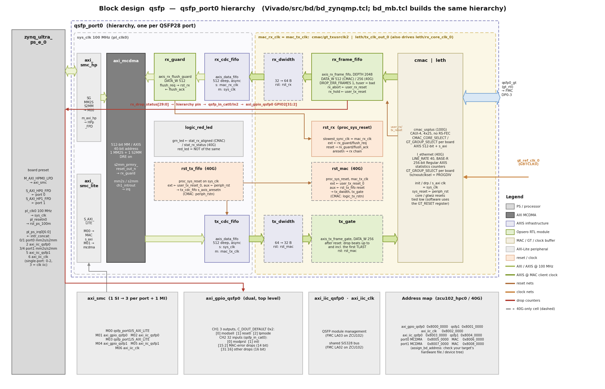
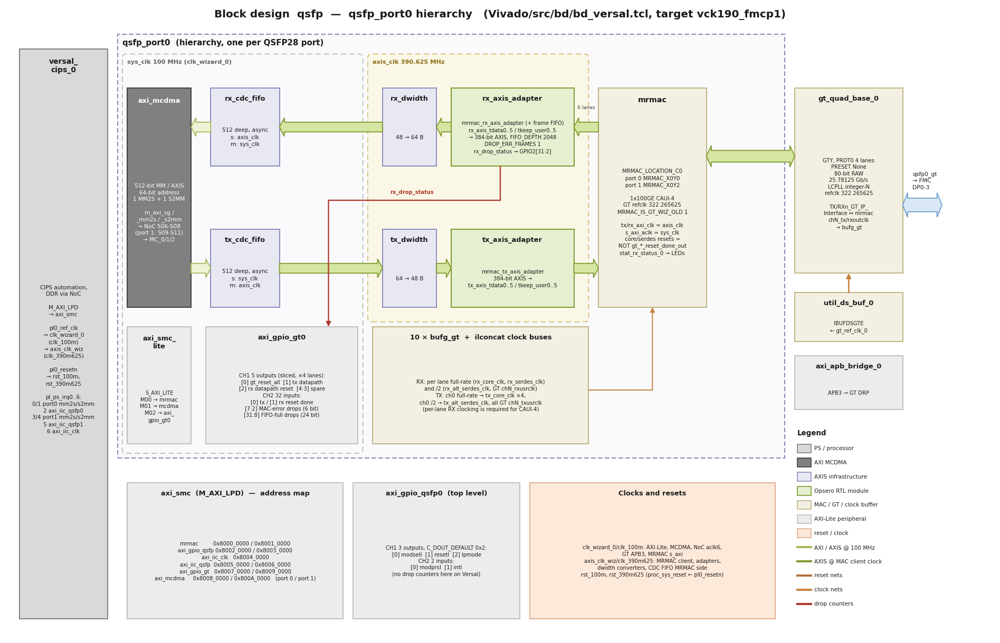

# Advanced: project structure and customization

This section is intended for users who want to modify the reference design — adding IP to
the block design, changing constraints, adding packages or drivers to the Linux images, and
so on. It describes how the repository is laid out, how the build flow works, how the block
designs assemble the QSFP28 ports, how the Linux BSPs are composed, and what has been added
on top of the stock AMD BSPs.

The actual *build* instructions are in [build_instructions](build_instructions); this section
is about understanding the project well enough to modify it.

## Repository layout

```
.
├── build.py                   <- Cross-platform build runner (the build logic)
├── build.sh / build.bat       <- Shims that invoke build.py (Linux/git bash, Windows)
├── Makefile                   <- Deprecated thin wrapper around build.sh (removed next version)
├── README.md
├── config/                    <- Source-of-truth design metadata and auto-generation
│   ├── data.json
│   └── update.py
├── docs/                      <- This documentation (Sphinx + Read the Docs)
├── Vivado/
│   ├── scripts/
│   │   ├── build.tcl          <- Project creation + block design assembly
│   │   └── xsa.tcl            <- Synthesis, implementation, XSA export
│   └── src/
│       ├── bd/
│       │   ├── bd_versal.tcl  <- Block design: Versal (MRMAC)
│       │   ├── bd_zynqmp.tcl  <- Block design: Zynq UltraScale+ (CMAC / 40G/50G subsystem)
│       │   └── bd_mb.tcl      <- Block design: MicroBlaze (KCU116)
│       ├── constraints/
│       │   └── <target>.xdc   <- One XDC per target (pin assignments)
│       └── hdl/
│           ├── mrmac_axis_adapter.v   <- MRMAC client ↔ AXI4-Stream adapters (+ RX frame FIFO)
│           ├── rx_frame_fifo.v        <- RX store-and-forward frame FIFO
│           ├── axis_rx_flush_guard.v  <- RX flush guard in front of the MCDMA S2MM
│           └── axis_tx_frame_gate.v   <- TX frame gate (40G)
├── Vitis/
│   ├── common/src/            <- Bare-metal echo server (main.c, mrmac.c, hse.c, si5328.c, vadj.c)
│   └── py/                    <- Vitis workspace / boot-file build scripts
├── PetaLinux/
│   └── bsp/                   <- Board BSPs (vck190, zcu1xx, kcu116) + port-config overlays (ports-*)
└── Yocto/
    ├── scripts/               <- The Yocto / EDF build engine (init, configure, build, package)
    └── bsp/                   <- Board layers (vck190, zcu1xx) + port-configs/ports-*
```

Per-target build outputs are written to `Vivado/<target>/`, `Vitis/<target>_workspace/`,
`Vitis/boot/<target>/`, `PetaLinux/<target>/` and `Yocto/<target>/`; packaged boot-image zips
are written to `bootimages/`. None of these are committed.

## Target naming

A *target label* is the canonical handle for a single design and is passed to every build
command via `--target`. It encodes the board and, where the board has more than one usable
FMC connector, the connector (`zcu102_hpc0`, `vck190_fmcp1`); the RFSoC and KCU116 labels are
the board name alone. An `_ss` suffix marks the 40G variant (40G/50G Ethernet Subsystem) of a
board whose default target is 100G (`zcu111_ss`, `zcu208_ss`, `zcu216_ss`, `kcu116_ss`). The
first underscore-delimited token is the *board* and selects the board BSP
(`PetaLinux/bsp/<board>/`, `Yocto/bsp/<board>/`).

The complete list of valid targets comes from `config/data.json`; run `./build.sh list` (or
`./build.sh labels` for one per line) to print it.

## `config/data.json` and `config/update.py`

`config/data.json` is the canonical source of truth for the set of supported designs and
their per-target metadata: board name and URL, the QSFP28 ports instantiated (`lanes`, see
the note below), line rate (`linkspeed`), FMC connector, which software flows the target
supports (`baremetal`, `petalinux`, `yocto`), the Vivado edition (`license`), whether the MAC
needs an IP license (`ip_license`), and the Linux port-config overlay (`portcfg`). The
`build.py` runner reads it at runtime. `config/update.py` regenerates the auto-managed files
that are *not* read at runtime: the target tables in the top-level `README.md`, the
`.gitignore`, and the residual UPDATER block in `PetaLinux/Makefile` — the sections delimited
by `UPDATER START` / `UPDATER END` (or `<!-- updater start -->` / `<!-- updater end -->`)
comment markers. The Sphinx documentation also reads `data.json` directly to render the
supported-board and target-design tables.

```{note}
Terminology: the `lanes` field of each design holds the list of QSFP28 *ports* the design
instantiates (`[0]` for port 0 only, `[0, 1]` for both ports). Each QSFP28 port is a single
MAC that uses four transceiver lanes internally. This mirrors how the Quad SFP28 FMC repo
uses `lanes` to mean SFP28 ports, so the same update machinery is reused unchanged.
```

When adding or modifying a target, edit `data.json` and re-run `update.py` (from the
`config/` directory). Do not hand-edit content between the updater markers; it will be
overwritten on the next regeneration. The `portcfg` field names the overlay that the Linux
flows apply (`ports-versal-01`, `ports-zu100g-01`, `ports-zu100g-0`, `ports-zu40g-01`; the
KCU116 entries `ports-mb100g-0` / `ports-mb40g-0` belong to the unsupported PetaLinux BSP).

## Build runner

All build stages are driven by the cross-platform `build.py` runner at the root of the
repository, invoked through the `build.sh` shim on Linux / git bash or `build.bat` on Windows
(identical arguments). It reads the target list and per-target attributes straight from
`config/data.json`, builds whatever a requested stage depends on automatically, skips anything
already built, and locates and sources the AMD tools itself — so there is no need to source
the Vivado / Vitis / PetaLinux settings scripts beforehand.

| Command      | Stage                                                                                 |
|--------------|---------------------------------------------------------------------------------------|
| `project`    | Create the Vivado project (`.xpr`) and block design.                                  |
| `xsa`        | Synthesise, implement and export the hardware (`.xsa`).                               |
| `standalone` | Create the Vitis workspace, build the echo server and its boot file.                  |
| `petalinux`  | Create the PetaLinux project from the XSA, apply the BSP overlays, build and package. |
| `yocto`      | Generate the System Device Tree and EDF machine from the XSA, build the image.        |
| `package`    | Gather the built boot artifacts into `bootimages/*.zip` (rewrites a zip whose artifacts are newer). |
| `all`        | Build every stage the target supports, then `package`.                                |
| `list`, `labels`, `status`, `clean` | List targets; per-stage artifact state; delete generated outputs (`--keep-boot` keeps the boot files). |

Run `./build.sh --help` and `./build.sh <command> --help` for all options. Per-target lock
files (`.<target>.lock` at the repository root) prevent two concurrent builds of the same
target from clobbering each other.

```{tip}
`./build.sh project --target <t>` creates the block design and runs `validate_bd_design`
**without** synthesis — use it to catch block-design wiring errors fast before committing to
the long XSA build.
```

## Vivado side

`build.tcl` selects the block-design script from the target's family (`bd_versal.tcl`,
`bd_zynqmp.tcl` or `bd_mb.tcl`) and passes it the board, the target, the list of QSFP28
ports and the line rate (`target_dict`). It adds `Vivado/src/hdl/*.v` to the project before
sourcing the block design, so that the RTL modules can be instantiated as module references,
and checks that Vivado is version 2025.2 (the block-design Tcl APIs are not stable across
releases). Each script creates one `qsfp_port<p>` hierarchy per port (`create_qsfp_port`
proc) and sizes the shared cells (interconnect, interrupts, NoC ports) from the number of
ports, so the same script builds single-port and two-port designs.

To see the netlist as actually built, open the project from `Vivado/<target>/`, or inspect the
saved `.bd` under `Vivado/<target>/<target>.gen/sources_1/bd/qsfp/`.

### Zynq UltraScale+ and MicroBlaze block design



`bd_zynqmp.tcl` (and `bd_mb.tcl`, which builds the identical `qsfp_port` hierarchy behind a
MicroBlaze, DDR4 MIG, UART16550, timer, interrupt controller and QSPI) per port:

* **MAC.** For a 100G target, a `cmac_usplus` (CAUI-4, 4x25, no RS-FEC, 512-bit AXIS + AXI4-
  Lite) with `CMAC_CORE_SELECT` / `GT_GROUP_SELECT` per board: ZCU111 port 0
  `CMACE4_X0Y0` on X0Y8–X0Y11 and port 1 `CMACE4_X0Y1` on X0Y12–X0Y15; ZCU208/ZCU216
  `CMACE4_X0Y1` on X0Y12–X0Y15 (port 0 only); KCU116 `CMACE4_X0Y0` on X0Y12–X0Y15. For a 40G
  target, an `l_ethernet` (40G, BASE-R, 256-bit regular AXI4-Stream, statistics counters,
  AXI4-Lite) on one GT quad per port: ZCU102 Quad_X1Y2 / Quad_X1Y1, ZCU106 Quad_X0Y3 /
  Quad_X0Y4, ZCU111 Quad_X0Y2 / Quad_X0Y3, ZCU208/ZCU216 Quad_X0Y3 / Quad_X0Y4, KCU116
  Quad_X0Y3. The MAC's core and GT-wizard reset inputs are tied off; software resets the GT
  through the MAC's `GT_RESET` register.
* **MAC clocking.** The CMAC's AXIS client runs on its `gt_txusrclk2` (322.27 MHz) and its
  `rx_clk` input is driven from the same clock. The `l_ethernet` core in this configuration
  has a single core clock, `tx_clk_out_0` (312.5 MHz): it launches the RX AXI4-Stream too, so
  `rx_core_clk_0` and every block on the RX stream are clocked by `tx_clk_out_0`, exactly as
  in the IP's example design.
* **RX chain.** `rx_frame_fifo` (`axis_rx_frame_fifo`, 2048 beats, drops frames the MAC flags
  bad) → `rx_dwidth` (40G only, 32 → 64 bytes) → `rx_cdc_fifo` (512 deep, asynchronous) →
  `rx_guard` (`axis_rx_flush_guard`) → MCDMA S2MM. The frame FIFO is the only block that
  sees the MAC's stream, which has no ready signal; everything behind it honours back-pressure.
* **RX resets.** The RX chain is deliberately **not** reset by MAC or GT resets, which could
  cut a frame the DMA is reading. A MAC RX reset (`user_rx_reset`) or an interruption of the
  MAC clock (`user_tx_reset`) only makes the frame FIFO discard the frame it is receiving
  (`rx_abort`, `rx_hold`). The whole chain is flushed only when the MCDMA's S2MM channel is
  reset (every interface open/close, DMA error recovery): the flush guard blocks the stream
  into the S2MM, requests the flush through the `rst_rx` reset block in the MAC clock domain,
  waits for it to complete, and releases the stream on a frame boundary.
* **TX chain.** MCDMA MM2S → `tx_cdc_fifo` → (40G only) `tx_dwidth` (64 → 32 bytes) →
  `tx_gate` (`axis_tx_frame_gate`) → MAC. On the 40G targets the TX chain on the MAC clock is
  reset (`rst_mac`) after any interruption of that clock, and the CDC FIFO from its sys_clk
  side (`rst_tx_fifo`), so the FIFO's pointers stay consistent; the TX gate then drops the
  tail of a frame whose head was flushed, up to and including its last beat.
* **MCDMA.** `axi_mcdma`, one MM2S and one S2MM channel, 512-bit, 40-bit addressing, with its
  three AXI masters merged by `axi_smc_hp` into `S_AXI_HP0_FPD` (port 0) or `S_AXI_HP1_FPD`
  (port 1); on the MicroBlaze they join the MIG's SmartConnect.
* **LEDs.** Green = the MAC's RX aligned / status output, red = its inverse.

At the top level, per port: `axi_gpio_qsfp<p>` (sideband + drop counters, see below),
`axi_iic_qsfp<p>` (module management), and one shared `axi_iic_clk` for the Si5328. A port
that a target does not use (port 1 on ZCU208/ZCU216 at 100G and on the KCU116) gets constant
sideband outputs: `ModSelL` = 1, `ResetL` = 0 (module held in reset), `LPMode` = 1, LEDs off.

### Versal block design



`bd_versal.tcl` adds the CIPS with the DDR / NoC automation, a 100 MHz system clock and a
390.625 MHz MRMAC client clock (two clock wizards on `pl0_ref_clk`), and per port a GTY
`gt_quad_base` (with its `util_ds_buf` reference-clock buffer and an APB3 bridge) and the
`qsfp_port<p>` hierarchy. The design choices specific to driving a QSFP28 port as 1x100GbE
CAUI-4 with the MRMAC are:

#### GT Quad configuration

The GT quad uses `PRESET None` and specifies the full PROT0 field set manually: GTY, four
lanes at 25.78125 Gb/s, **LCPLL integer-N**, 322.265625 MHz reference clock, 80-bit RAW
datapath. The MRMAC requires an 80-bit RAW GT datapath that no named Ethernet preset
provides, which is why `PRESET None` is used and every field is set explicitly. The field set
is merged onto the 2025.2 IP's default LR0 dictionary, applying only field names that exist
in this IP version.

#### Per-lane CAUI-4 user clocking

CAUI-4 bonds four lanes and requires them to align, so each lane's recovered RX clock must
drive that lane's MRMAC serdes/core clock:

* **RX:** each of the four GT lanes gets its own pair of `BUFG_GT` buffers — a full-rate
  `usrclk` and a half-rate (`/2`) `usrclk2`. The MRMAC `rx_serdes_clk`/`rx_core_clk` buses
  take the per-lane full-rate clocks; `rx_alt_serdes_clk` takes the per-lane half-rate
  clocks; the GT `chN_rxusrclk` inputs take the per-lane half-rate clocks.
* **TX:** all four lanes share the TX PLL, so a single `ch0` pair drives all four TX lanes
  (`tx_core_clk` = ch0 full-rate ×4; `tx_alt_serdes_clk` and the GT `chN_txusrclk` inputs =
  ch0 half-rate).

```{warning}
Driving the MRMAC RX serdes/core clocks from `ch0` alone (broadcasting one lane's recovered
clock to all four) leaves lanes 1–3 sampled in the wrong clock domain — those PCS lanes never
block-lock and 100G alignment never completes, **even with a passive loopback**. The per-lane
clocking above is mandatory for CAUI-4. (The AXIS *client* clocks `tx_axi_clk`/`rx_axi_clk`
are a separate, single 390.625 MHz domain — do not confuse the two clock buses.)
```

#### MRMAC client AXIS adapters

The MRMAC 100G "Independent 384b Non-Segmented" client is **not** a standard AXI4-Stream bus.
In the block design its `axis_rx_port0` / `axis_tx_port0` interfaces are handshake-only; the
384-bit data rides on six separate 64-bit lane ports (`rx`/`tx_axis_tdata0..5`) plus six
per-lane `tkeep_user0..5[10:0]` control words. Feeding the handshake-only interface straight
into a stock `axis_dwidth_converter` mis-delineates frames (one packet per 384-bit beat).

`Vivado/src/hdl/mrmac_axis_adapter.v` provides the two adapters:

* `mrmac_tx_axis_adapter` unpacks a standard 384-bit AXIS stream (`tdata[383:0]`,
  `tkeep[47:0]`, `tlast`) into the six MRMAC lanes.
* `mrmac_rx_axis_adapter` packs the six lanes into a standard 384-bit stream and contains the
  store-and-forward **RX frame FIFO** (`FIFO_DEPTH` 2048 × 48 bytes = 96 KB, about 26 block
  RAMs per port). The MRMAC RX has no ready signal, and the S2MM path behind it (512 bits ×
  100 MHz = 51.2 Gb/s) is slower than the 100G line, so the FIFO absorbs line-rate bursts and
  downstream stalls; when it overflows it drops frames whole, never truncated or merged.
  Frames the MAC flags as errored are dropped too (`DROP_ERR_FRAMES` = 1).

#### Width conversion, CDC and MCDMA

The MRMAC client runs at 390.625 MHz / 384-bit; the MCDMA and NoC run at the 100 MHz system
clock / 512-bit. Each direction has an `axis_dwidth_converter` (384 ↔ 512 bit) and an
asynchronous `axis_data_fifo` (512 deep) for the clock-domain crossing. The AXI MCDMA (one
MM2S and one S2MM channel, 512-bit, 64-bit addressing) moves packet data to/from DDR over
three NoC slave ports per QSFP28 port (scatter-gather, MM2S, S2MM → memory-controller ports
MC_0, MC_1, MC_2).

#### MRMAC placement

Both MRMACs default to `MRMAC_LOCATION_C0 = MRMAC_X0Y0`, which makes port 1 fail placement
("bel is occupied"). The script pins each port's MRMAC to the integrated-MAC site in the
clock region of its GT quad:

```
port 0 : GTY_QUAD_X1Y1 (region X9Y1) -> MRMAC_X0Y0
port 1 : GTY_QUAD_X1Y2 (region X9Y2) -> MRMAC_X0Y2
```

#### GT-control GPIO

The `xilinx_axienet` MRMAC driver resets the GT and reads the reset-done flags through a
dual-channel AXI GPIO per port (`axi_gpio_gt<p>`): channel 1 drives `gt_reset_all`,
`gt_reset_tx_datapath` and `gt_reset_rx_datapath` (each replicated to the four lanes) plus
two spare lines; channel 2 returns the TX/RX reset-done flags and the RX drop counters (see
below). The device tree points the driver at these lines with the `gt-*-gpios` properties.

### QSFP28 module sideband and power-on reset

Each port has a dual-channel AXI GPIO (`axi_gpio_qsfp<p>`) for the QSFP28 module's sideband
signals. Channel 1 (outputs): bit 0 = `ModSelL`, bit 1 = `ResetL`, bit 2 = `LPMode`. Channel 2
(inputs): bit 0 = `ModPrsL`, bit 1 = `IntL` (and, on the Zynq UltraScale+ and MicroBlaze
targets, the drop counters in the upper bits).

`ResetL` is active-low — the module is held in reset while the line is 0. The GPIO is given a
power-on output default of `0x2` (`CONFIG.C_DOUT_DEFAULT`), so the lines come up
`ModSelL = 0`, `ResetL = 1` (released), `LPMode = 0` (high power): the module is enabled the
instant the device is configured, before any software runs.

```{important}
Without this default the GPIO powers up at `0x0`, so `ResetL = 0` and the QSFP28 module is
**held in reset** — its laser stays off and no link comes up. A passive *electrical* loopback
still works in that state (it needs no powered module), which masks the problem; a real
optical module or AOC stays dark until `ResetL` is released.
```

The drivers manage only the **GT** resets; they never touch the module's reset, which is board
glue. The lines stay software-controllable through the GPIO (for example to power-cycle a
module by writing `0x0` and then `0x2` to the GPIO's channel 1 data register at offset `0x0`).

### RX drop counters

The RX frame FIFO of each port counts the frames it drops. The counters are free running since
the device was configured (they are not cleared by MAC, link or DMA resets) and wrap around.
They are read from channel 2 of an AXI GPIO (`GPIO2_DATA`, offset `0x8` from the GPIO's base
address), and the layout depends on the device family:

**Versal (`vck190_fmcp1`)** — channel 2 of the GT-control GPIO `axi_gpio_gt<p>`, read at
`0x8007_0008` (port 0) and `0x8009_0008` (port 1):

| Bits | Content |
|------|---------|
| `[0]` | GT TX reset done |
| `[1]` | GT RX reset done |
| `[7:2]` | Frames dropped because the MAC flagged them bad (6-bit counter) |
| `[31:8]` | Frames dropped because the RX frame FIFO was full (24-bit counter) |

**Zynq UltraScale+ and MicroBlaze targets** — channel 2 of the sideband GPIO
`axi_gpio_qsfp<p>`, read at `<axi_gpio_qsfp<p> base> + 0x8` (for example `0x8000_0008` /
`0x8001_0008` on the ZCU102 and ZCU106; see the address maps below):

| Bits | Content |
|------|---------|
| `[0]` | `ModPrsL` |
| `[1]` | `IntL` |
| `[15:2]` | Frames dropped because the MAC flagged them bad (FCS error etc., 14-bit counter) |
| `[31:16]` | Frames the MAC received good but the FIFO dropped: FIFO full, frame too long for the FIFO, or frame cut by a MAC/GT reset (16-bit counter) |

On these targets, frames the MAC received good = frames received by Linux +
`rx_dma_pkt_drop` (`ethtool -S`) + bits `[31:16]`. The fields are small wrapping counters meant
for short-interval diagnostics (read before and after a test): the 14-bit error field can wrap
within a second of bad frames at line rate. For long-term error counts on the 40G targets use
the 64-bit `hse_mac_rx_*` counters of `ethtool -S` (see
[Testing under Linux](linux_usage.md#port-statistics)). The Linux gpio line numbers of
`ModPrsL` / `IntL` are unaffected by the counters.

From Linux, the register can be read with a physical-memory access tool such as `devmem2`, if
your image includes one (for example `devmem2 0x80000008 w`).

### Address and interrupt maps

The control peripherals are AXI-Lite slaves of the processor (`M_AXI_LPD` on Versal,
`M_AXI_HPM0_LPD` on Zynq UltraScale+, the MicroBlaze peripheral interconnect on the KCU116),
64 KB each. Addresses are assigned by `assign_bd_address`, so check your target's hardware
(the `.xsa` or the generated device tree) after modifying a block design.

| Peripheral | `vck190_fmcp1` | `zcu102_hpc0`, `zcu106_hpc0`, `zcu111`, `*_ss` (2 ports) | `zcu208`, `zcu216` (1 port) | `kcu116`, `kcu116_ss` |
|------------|----------------|---------------------------------------------------------|-----------------------------|------------------------|
| MAC, port 0 / 1 | `0x8000_0000` / `0x8001_0000` | `0x8006_0000` / `0x8008_0000` | `0x8004_0000` | `0x44A3_0000` |
| AXI MCDMA, port 0 / 1 | `0x8008_0000` / `0x800A_0000` | `0x8005_0000` / `0x8007_0000` | `0x8003_0000` | `0x44A2_0000` |
| QSFP sideband GPIO, port 0 / 1 | `0x8002_0000` / `0x8003_0000` | `0x8000_0000` / `0x8001_0000` | `0x8000_0000` | `0x4000_0000` |
| GT-control GPIO, port 0 / 1 | `0x8007_0000` / `0x8009_0000` | — | — | — |
| QSFP module IIC, port 0 / 1 | `0x8005_0000` / `0x8006_0000` | `0x8003_0000` / `0x8004_0000` | `0x8002_0000` | `0x4081_0000` |
| Si5328 IIC (shared) | `0x8004_0000` | `0x8002_0000` | `0x8001_0000` | `0x4080_0000` |

The KCU116 designs also contain the UART16550 (`0x44A1_0000`), the QSPI controller
(`0x44A0_0000`), the AXI timer (`0x41C0_0000`), the interrupt controller (`0x4120_0000`) and a
reset GPIO (`0x4001_0000`).

Interrupts are connected in this order (on Versal to `pl_ps_irq0..6`, SPI 84 + index; on Zynq
UltraScale+ to `pl_ps_irq0[6:0]`; on the KCU116 to the AXI interrupt controller):

| Index | Two-port targets | Single-port Zynq UltraScale+ | KCU116 |
|-------|------------------|------------------------------|--------|
| 0 | Port 0 MCDMA `mm2s` | Port 0 MCDMA `mm2s` | Port 0 MCDMA `mm2s` |
| 1 | Port 0 MCDMA `s2mm` | Port 0 MCDMA `s2mm` | Port 0 MCDMA `s2mm` |
| 2 | Port 0 QSFP module IIC | Port 0 QSFP module IIC | Port 0 QSFP module IIC |
| 3 | Port 1 MCDMA `mm2s` | Si5328 IIC | Si5328 IIC |
| 4 | Port 1 MCDMA `s2mm` | | UART16550 |
| 5 | Port 1 QSFP module IIC | | AXI timer |
| 6 | Si5328 IIC | | QSPI |

The MACs themselves have no interrupt in these designs (hence the harmless
`Ethernet core IRQ not defined` boot message on the Zynq UltraScale+ targets).

### Constraints

`Vivado/src/constraints/<target>.xdc` contains the pin assignments: the transceiver lanes
(DP0–3 for port 0, DP4–7 for port 1 where present), the two GT reference clocks
(GBTCLK0/GBTCLK1), the three IIC buses (shared Si5328 on LA02, QSFP0 on LA03, QSFP1 on
LA17_CC), and the per-port QSFP28 sideband I/O and user LEDs. On some boards the FMC DP lanes
are not wired to the GT channels in order; each XDC lists the FMC DP number of every lane in a
comment (Ethernet multi-lane PCS tolerates the lane permutation).

### Modifying the block design

Edit the block-design script of the target's family. Most per-port logic lives in the
`create_qsfp_port` proc, which is called once per entry in `ports`; structural counts
(interconnect masters, NoC ports, interrupts) are derived from the number of ports. After
editing, delete the existing project directory and rebuild:

```
rm -rf Vivado/<target>
./build.sh xsa --target <target>
```

## Linux BSPs

### BSP composition

Both Linux flows compose the image from two fragments:

1. A **board BSP**: `PetaLinux/bsp/<board>/project-spec/` or `Yocto/bsp/<board>/`. It provides
   the board kernel and U-Boot configuration, the board device-tree fixes, the kernel
   patches, the rootfs configuration and the `qsfp-loopback-test` recipe.
2. A **port-config overlay**: `PetaLinux/bsp/<portcfg>/` or `Yocto/bsp/port-configs/<portcfg>/`,
   selected by the target's `portcfg` field in `data.json`. It provides `port-config.dtsi`, the
   device-tree fragment that wires up the MACs, MCDMAs and the Si5328 for the ports active on
   the target. The overlay is applied after the board BSP.

In the PetaLinux flow both `project-spec/` trees are copied into the project when it is
created; in the Yocto flow the board layer and the overlay are added as layers, and the
device-tree files are included only in the Linux (APU) domain device tree.

### The `port-config.dtsi` overlay

Per port, on the device-tree node that the System Device Tree generates for the MAC:

* `compatible` — on Zynq UltraScale+, `"xlnx,cmac-usplus-3.1"` or `"xlnx,l-ethernet-4.0"`, which
  the HSE kernel patch binds to.
* `axistream-connected` → the port's MCDMA node, plus the MCDMA channel interrupts
  (`mm2s_ch1_introut` / `s2mm_ch1_introut`) with their `interrupt-parent` / `interrupts`: the
  driver looks the interrupts up by name on the MAC node.
* `local-mac-address` (`00:0a:35:00:00:00` for port 0, `00:0a:35:00:00:01` for port 1),
  `xlnx,channel-ids`, `xlnx,num-queues`, `xlnx,addrwidth`.
* `max-speed` (`100000` or `40000`). On Versal also `xlnx,mrmac-rate = <100000>`: the driver
  reads `max-speed` first, and without the override the generated value (the per-lane rate,
  25000) would bring the port up at 25G.
* Versal only: the `gt-ctrl-gpios`, `gt-tx-dpath-gpios`, `gt-rx-dpath-gpios`,
  `gt-ctrl-rate-gpios`, `gt-tx-rst-done-gpios` and `gt-rx-rst-done-gpios` properties on the
  port's GT-control GPIO, and `xlnx,gtlane = <0>`; the three unused `mrmac_1/_2/_3` nodes the
  generator emits per MRMAC are disabled.

It also overrides each MCDMA node's `compatible` to `"xlnx,eth-dma"`, and instantiates the
Si5328 (`silabs,si5328`, `clock-generator@68` on the shared clock IIC bus, 114.285 MHz crystal,
`clk0` output at 322.265625 MHz for 100G or 156.25 MHz for 40G).

### Modifications layered on the stock BSPs

This list answers *"what would I lose if I replaced the BSP with the stock one?"*

* **AXI Ethernet + MCDMA driver** (`bsp.cfg`). `CONFIG_XILINX_AXI_EMAC` with
  `CONFIG_AXIENET_HAS_MCDMA`, `CONFIG_GPIO_XILINX`, `CONFIG_I2C_XILINX` and
  `CONFIG_NET_PKTGEN=m` (used by the self-test); the ZynqMP BSPs also enable the Si5324/Si5328
  clock driver (`CONFIG_COMMON_CLK_SI5324`).
* **MCDMA `compatible` override (device tree).** `xilinx_axienet` maps the MCDMA registers
  itself, but the standalone `xilinx_dma` dmaengine driver also matches the MCDMA node and
  claims the region first, so the probe fails with `-EBUSY`. Because `CONFIG_XILINX_AXI_EMAC`
  depends on `XILINX_DMA`, the dmaengine driver cannot simply be disabled; the
  `compatible = "xlnx,eth-dma"` override keeps it off the MCDMA.
* **Kernel patches** (`recipes-kernel/linux/linux-xlnx/`, registered in
  `linux-xlnx_%.bbappend`):

  | Patch | Targets | Purpose |
  |-------|---------|---------|
  | `0001-clk-si5324-enable-ckout2-for-2x-qsfp28-fmc` | all | Enables the Si5328 CKOUT2 output (GBTCLK1, port 1's reference clock), which the stock driver disables, and gives it CKOUT1's divider. |
  | `0002-net-axienet-mrmac-carrier-link-monitor` | Versal | MRMAC link monitor: the interface opens with carrier off, the monitor drives the carrier from block lock and RX status, recovers the link with the same reset sequence as `open()` while it is down, and logs `MRMAC link up` / `MRMAC link down`. |
  | `0003`/`0006 …-default-to-1024-RX-descriptors…` | all | RX ring default of 1024 descriptors on MRMAC and HSE ports. |
  | `0004`/`0007 …-report-the-MCDMA-S2MM-packet-drop-count…` | all | The MCDMA S2MM packet-drop count as `rx_dma_pkt_drop` in `ethtool -S`. |
  | `0002-net-axienet-add-hse-cmac-l-ethernet-support` | ZynqMP | Adds the CMAC / 40G-50G subsystem ("HSE") MAC type to `xilinx_axienet`, with a link monitor. |
  | `0003-net-axienet-hse-exempt-pcs-handle-requirement` | ZynqMP | Lets the PHY-less HSE ports probe without a `pcs-handle` / `phy-handle`. |
  | `0004-net-axienet-hse-fix-l_ethernet-register-map` | ZynqMP | Uses the 40G/50G subsystem's own register offsets and clears its SLVERR-indication bits (status reads racing the GT clock bring-up return a marker instead of a fatal bus error). |
  | `0005-net-axienet-hse-fix-latched-low-link-poll` | ZynqMP | Reads the latched-low RX status correctly, so the link can come up on an idle system. |
  | `0008`, `0009`, `0010 …-hse-…monitor…` | ZynqMP | The HSE link monitor: statistics latching, bad-code / BIP detection, RX-only recovery resets, no full GT reset without a usable signal, interval-based status sampling, visible partner outages, RX wedge restart, and the `hse_*` counters. |

* **Board device-tree fixes.** The board's TI DP83867 Ethernet PHY(s) with their RGMII delays
  and a fixed MAC address (`board-user.dtsi` on ZynqMP, `system-user.dtsi` on Versal, which
  also pins the ZOCL node to `xlnx,zocl-versal`).
* **VCK190 U-Boot.** FMC VADJ enabled at 1.5 V before every boot (PetaLinux `platform-top.h`,
  Yocto `vck190-vadj-bootcmd.cfg`), and a larger device-tree size headroom (Yocto).
* **Kernel command line and hostname.** See the [PetaLinux](petalinux) and [Yocto](yocto)
  pages.
* **Loopback self-test app.** The `qsfp-loopback-test` recipe
  (`recipes-apps/qsfp-loopback-test/`), installed in every image.
* **Root filesystem additions.** `ethtool`, `iperf3`, `iproute2` (`nstat` on Yocto),
  `i2c-tools`, `phytool` and the other tools listed on the [Yocto](yocto) page.

### Adding a kernel config option, patch, package or device-tree node

* **Kernel config:** append `CONFIG_<name>=y` to the board BSP's
  `recipes-kernel/linux/linux-xlnx/bsp.cfg`.
* **Kernel patch:** drop the `.patch` into `recipes-kernel/linux/linux-xlnx/` and add a
  `SRC_URI:append` line to `linux-xlnx_%.bbappend`.
* **Rootfs package:** PetaLinux: add `CONFIG_<package>=y` to `configs/rootfs_config` (and
  declare it in `meta-user/conf/user-rootfsconfig` if it is not in the default menu). Yocto:
  add it to `IMAGE_INSTALL:append` in `recipes-core/images/edf-linux-disk-image.bbappend`.
* **Per-board device tree:** edit `board-user.dtsi` (Yocto ZynqMP), `system-user.dtsi`
  (Yocto Versal and PetaLinux).
* **Per-port device tree:** edit the target's `port-config.dtsi` overlay.

```{tip}
After a *structurally-changed* XSA (new peripherals/addresses), a PetaLinux
`petalinux-config --get-hw-description` on an existing project keeps the stale System Device
Tree ("workspace already set up, leaving as-is"). Remove `<target>/components/plnx_workspace`
before re-importing to force a fresh one, then rebuild (this reuses the sstate cache, so it is
incremental).
```

## Where build outputs land

| Path                                | Contents                                                  |
|-------------------------------------|-----------------------------------------------------------|
| `Vivado/<target>/`                  | Vivado project. `qsfp_wrapper.xsa` is the export.         |
| `Vivado/logs/`                      | Per-target Vivado build logs.                             |
| `Vitis/<target>_workspace/`, `Vitis/boot/<target>/` | Vitis workspace; standalone boot file.    |
| `PetaLinux/<target>/images/linux/`  | `BOOT.BIN`, `image.ub`, `boot.scr`, `rootfs.tar.gz`, etc. |
| `Yocto/<target>/images/linux/`      | `rootfs.wic.xz`, `rootfs.wic.bmap`, `BOOT.BIN`, kernel, device tree, etc. |
| `bootimages/`                       | Per-target zipped boot files (`2x-qsfp28-fmc_<target>_<flow>-2025-2.zip`). |

None of these directories are committed to the repository.
