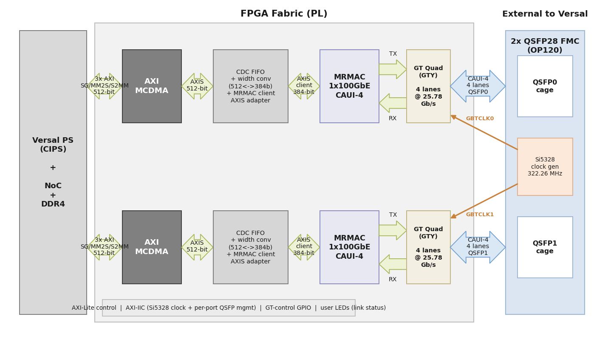

# Description

In this reference design, each port of the [2x QSFP28 FMC] is driven by the Versal
[Integrated 100G Multirate Ethernet MAC (MRMAC)] configured for a single 100GbE (CAUI-4)
channel. All four GTY transceiver lanes of a QSFP28 port are bonded into one 100G MAC. Packet
data is moved to and from system memory (DDR) by an AXI MCDMA, through the Versal NoC, and the
ports are driven under PetaLinux by the AXI Ethernet (`xilinx_axienet`) driver.

This contrasts with the Opsero [Quad SFP28 FMC] reference design, which uses the 10G/25G Ethernet
Subsystem with one independent channel per SFP28 port. Here, the 100G data rate per port and the
CAUI-4 lane bonding require the integrated MRMAC and a different datapath, described below.

## Block diagram

Each of the two QSFP28 ports is an independent, identical 100G subsystem:

* **MRMAC (1x100GbE CAUI-4).** The Versal integrated MRMAC is configured as a single 100GbE
  port using the `1x100GE CAUI-4 Wide` preset, with an independent 384-bit non-segmented client
  interface.
* **GT Quad (GTY).** Each port uses one GTY quad: four lanes, each running at 25.78125 Gb/s
  (raw, 80-bit datapath) off a 322.265625 MHz reference clock. Lane bonding into a single 100G
  MAC happens inside the MRMAC core. Because CAUI-4 requires all four lanes to align, the GT
  user-clocking is per-lane (each lane's recovered clock drives its own MRMAC serdes/core
  clock).
* **MRMAC client AXIS adapter.** The MRMAC 100G client is not a standard AXI4-Stream bus — its
  384-bit data rides on six 64-bit lane ports plus per-lane control words. A small custom RTL
  adapter packs/unpacks these six lanes into one standard 384-bit AXI4-Stream so that frames are
  delineated correctly (one `TLAST` per Ethernet frame).
* **Datapath to DDR.** A width converter (384 ↔ 512 bit) and an asynchronous CDC FIFO bridge the
  390.625 MHz MRMAC client clock domain to the system clock domain, where an AXI MCDMA moves
  packet data to and from DDR over three NoC AXI ports (scatter-gather, MM2S, S2MM).
* **Clocking.** A single Si5328 jitter-attenuating clock generator on the FMC sources both GT
  reference clocks (GBTCLK0 for port 0, GBTCLK1 for port 1) at 322.265625 MHz.
* **Control and sideband.** Per port, an AXI-Lite control path reaches the MRMAC, the MCDMA, and
  a GT-control AXI GPIO (which lets the Linux driver reset the transceiver and read reset-done).
  An AXI IIC controller per port reaches the QSFP module management bus, a shared AXI IIC reaches
  the Si5328, and the QSFP module sideband signals plus user LEDs (link status) are driven from
  AXI GPIO.

## Supported Hardware Platforms

The hardware design provided in this reference is based on Vivado and supports the AMD Versal
evaluation board(s) listed below. The repository contains all necessary scripts and code to build
the design for the supported platform(s):








### {{ group.name }} boards

| Carrier board    | Supported FMC connector(s) | 100G support |
|------------------|----------------------------|--------------|
| [{{ name }}]({{ board.link }}) | {{ connector }}  | ✅ |




The 2x QSFP28 FMC requires a carrier board whose FMC connector routes eight gigabit transceivers
(two QSFP28 ports × four lanes) capable of 25.78125 Gb/s, and an AMD device that contains the
integrated MRMAC. The VCK190 satisfies both via its FMCP1 connector.

## Supported Software

This reference design is driven within a PetaLinux environment. The repository includes all
necessary scripts and code to build the PetaLinux environment. The table below outlines the
corresponding applications available:

| Environment      | Available Applications  |
|------------------|-------------------------|
| PetaLinux        | Built-in Linux commands Additional tools: ethtool, iperf3 Bundled self-test: `mrmac-loopback-test` |

[2x QSFP28 FMC]: https://docs.opsero.com/op120/datasheet/overview/
[Quad SFP28 FMC]: https://docs.opsero.com/op081/datasheet/overview/
[Integrated 100G Multirate Ethernet MAC (MRMAC)]: https://www.amd.com/en/products/adaptive-socs-and-fpgas/intellectual-property/mrmac.html
