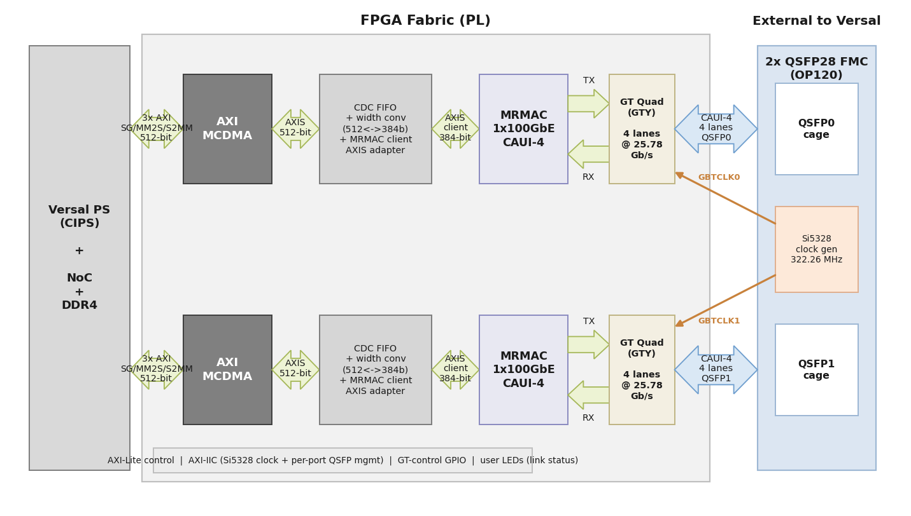

# Description

In this reference design, each port of the [2x QSFP28 FMC] is driven by a hardened or soft
Ethernet MAC that depends on the target device family: on Versal, the
[Integrated 100G Multirate Ethernet MAC (MRMAC)] configured for a single 100GbE (CAUI-4)
channel; on the Zynq UltraScale+ RFSoC boards and the Kintex UltraScale+ KCU116, the
UltraScale+ Integrated 100G Ethernet (CMAC) hard block; and on the GTH-based ZynqMP boards
(ZCU102/ZCU106), the 40G/50G High Speed Ethernet Subsystem at 40G. Every CMAC target also
has an `_ss`-suffixed variant that swaps the CMAC for the 40G/50G High Speed Ethernet
Subsystem at 40G (see below). All four transceiver lanes of a QSFP28 port are bonded into
one MAC. Packet data is moved to and from system memory (DDR) by an AXI MCDMA and the
ports are driven under Linux by the AXI Ethernet (`xilinx_axienet`) driver.

This contrasts with the Opsero [Quad SFP28 FMC] reference design, which uses the 10G/25G Ethernet
Subsystem with one independent channel per SFP28 port. Here, the 100G data rate per port and the
CAUI-4 lane bonding require the integrated MRMAC and a different datapath, described below.

## Block diagram

Each of the two QSFP28 ports is an independent, identical 100G subsystem:

* **MRMAC (1x100GbE CAUI-4).** The Versal integrated MRMAC is configured as a single 100GbE
  port using the `1x100GE CAUI-4 Wide` preset, with an independent 384-bit non-segmented client
  interface.
* **GT Quad (GTY).** Each port uses one GTY quad: four lanes, each running at 25.78125 Gb/s
  (raw, 80-bit datapath) off a 322.265625 MHz reference clock. Lane bonding into a single 100G
  MAC happens inside the MRMAC core. Because CAUI-4 requires all four lanes to align, the GT
  user-clocking is per-lane (each lane's recovered clock drives its own MRMAC serdes/core
  clock).
* **MRMAC client AXIS adapter.** The MRMAC 100G client is not a standard AXI4-Stream bus — its
  384-bit data rides on six 64-bit lane ports plus per-lane control words. A small custom RTL
  adapter packs/unpacks these six lanes into one standard 384-bit AXI4-Stream so that frames are
  delineated correctly (one `TLAST` per Ethernet frame).
* **Datapath to DDR.** A width converter (384 ↔ 512 bit) and an asynchronous CDC FIFO bridge the
  390.625 MHz MRMAC client clock domain to the system clock domain, where an AXI MCDMA moves
  packet data to and from DDR over three NoC AXI ports (scatter-gather, MM2S, S2MM).
* **Clocking.** A single Si5328 jitter-attenuating clock generator on the FMC sources both GT
  reference clocks (GBTCLK0 for port 0, GBTCLK1 for port 1) at 322.265625 MHz.
* **Control and sideband.** Per port, an AXI-Lite control path reaches the MRMAC, the MCDMA, and
  a GT-control AXI GPIO (which lets the Linux driver reset the transceiver and read reset-done).
  An AXI IIC controller per port reaches the QSFP module management bus, a shared AXI IIC reaches
  the Si5328, and the QSFP module sideband signals plus user LEDs (link status) are driven from
  AXI GPIO — held out of reset at power-on so an inserted optical module/AOC comes up enabled.

## ZynqMP targets (ZCU111, ZCU208, ZCU216, ZCU102, ZCU106)

ZynqMP devices have no MRMAC, so these targets use a different MAC while keeping the same
architecture (per-port MAC + AXI MCDMA to DDR, CPU handles all packets):

* **RFSoC boards (ZCU111/ZCU208/ZCU216) — 100G CMAC.** Each active port is an UltraScale+
  Integrated 100G Ethernet (CMAC) hard block in CAUI-4 mode (4 GTY lanes at 25.78125 Gb/s,
  322.265625 MHz refclk) with its in-core GT quad and a standard 512-bit AXI4-Stream client —
  no custom RTL adapters are needed. On the ZCU111 both ports run 100G; on the ZCU208/ZCU216
  only one of the two CMAC blocks can physically reach the FMC+ GT quads, so those targets
  implement a single 100G port (QSFP port 0) and hold the port 1 module in reset.
* **ZCU102/ZCU106 — 2x 40G.** The GTH transceivers on these boards max out below the 25.78125
  Gb/s CAUI-4 lane rate, so each port is a 40G/50G High Speed Ethernet Subsystem (soft
  MAC/PCS) in 40GBASE-R4 mode (4 GTH lanes at 10.3125 Gb/s, 156.25 MHz refclk) with a 256-bit
  AXI4-Stream client. This core requires an AMD license (an evaluation license works for
  testing).
* **RFSoC `_ss` variants (zcu111_ss/zcu208_ss/zcu216_ss) — 2x 40G.** These swap the CMAC for
  the same 40G/50G Ethernet Subsystem, running the QSFP28 ports at 40G over the GTY lanes.
  Because the soft MAC has no CMAC placement restriction, the ZCU208/ZCU216 `_ss` variants
  enable **both** QSFP28 ports — where the 100G CMAC targets are single-port.
* **Datapath to DDR.** Per port, an asynchronous CDC FIFO (plus a 512↔256-bit width converter
  on the 40G targets) bridges the MAC client clock to the 100 MHz system clock, where a
  512-bit AXI MCDMA moves packet data to and from the PS DDR through its own `S_AXI_HPx_FPD`
  port.
* **Linux driver.** The ports are driven by the same `xilinx_axienet` driver as the Versal
  MRMAC targets; CMAC / 40G-50G MAC support is added by a kernel patch carried in the Yocto
  board BSPs, including a carrier monitor that brings the link up automatically once the
  Si5328 reference clock is programmed and a partner signal is present.

## MicroBlaze target (KCU116)

The Kintex UltraScale+ KCU116 has no processor system, so the `kcu116` (100G CMAC) and
`kcu116_ss` (40G subsystem) targets instantiate a Linux-capable MicroBlaze soft CPU (MMU +
caches) running from the board's 1GB DDR4 (MIG), with the same per-port MAC + AXI MCDMA
datapath as the other targets, plus an AXI UART16550 console, AXI timer/interrupt
controller and an AXI Quad SPI reaching the board's configuration flash through the
STARTUPE3 primitive (for flash boot and Linux MTD access):

* The KCU116 FMC HPC connector wires only DP0-3 (one GTY quad, bank 227), so both KCU116
  targets are **single-port** (QSFP slot 0); the QSFP slot 1 module is held in reset.
* The KU5P device's single CMAC (`CMACE4_X0Y0`) reaches the FMC quad, giving a true 100G
  hard-MAC port on a Standard-Edition (free Vivado license) device.
* These targets build Linux with **PetaLinux** (classic MicroBlaze flow). The AMD EDF Yocto
  flow in 2025.2 does not yet support Linux on MicroBlaze, so the Yocto build is not
  offered for KCU116 in this release.
* The KCU116's microSD slot is connected to the board's system controller (not the FPGA),
  so Linux runs with its root filesystem in RAM (initramfs). Boot from the QSPI flash
  (`boot.mcs`) or over JTAG.

## Supported Hardware Platforms

The hardware design provided in this reference is based on Vivado and supports the AMD Versal
evaluation board(s) listed below. The repository contains all necessary scripts and code to build
the design for the supported platform(s):








### {{ group.name }} boards

| Carrier board    | Supported FMC connector(s) | 100G support |
|------------------|----------------------------|--------------|
| [{{ name }}]({{ board.link }}) | {{ connector }}  | ✅ |




For two ports at 100G, the 2x QSFP28 FMC requires a carrier board whose FMC connector routes
eight gigabit transceivers (two QSFP28 ports × four lanes) capable of 25.78125 Gb/s, and an
AMD device with an integrated MRMAC or CMAC that can reach those transceivers. Boards that
route fewer lanes (KCU116: four) or slower transceivers (ZCU102/ZCU106: GTH) are supported
with fewer ports and/or the 40G subsystem MAC, as described above.

## Supported Software

These reference designs can be driven by a standalone (bare-metal) application or from
within an embedded Linux environment, built with either of two flows: PetaLinux, or
Yocto / EDF (AMD's Embedded Development Framework, the announced successor to
PetaLinux). The repository includes all necessary scripts and code to build each of
them. The table below outlines the corresponding applications available:

| Environment      | Available Applications  |
|------------------|-------------------------|
| Standalone       | Raw-Ethernet [echo server](echo_server) (ARP, ICMP ping, UDP echo on all QSFP28 ports) |
| PetaLinux / Yocto | Built-in Linux commands Additional tools: ethtool, iperf3, iproute2 Bundled self-test: `qsfp-loopback-test` |

[2x QSFP28 FMC]: https://docs.opsero.com/op120/datasheet/overview/
[Quad SFP28 FMC]: https://docs.opsero.com/op081/datasheet/overview/
[Integrated 100G Multirate Ethernet MAC (MRMAC)]: https://www.amd.com/en/products/adaptive-socs-and-fpgas/intellectual-property/mrmac.html
