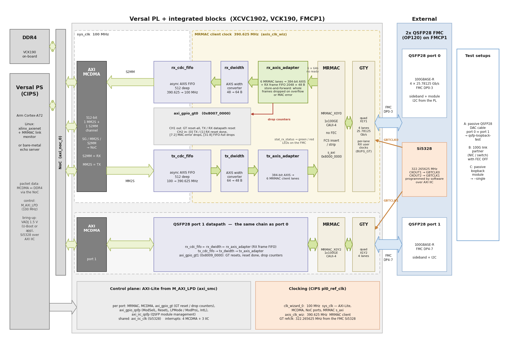
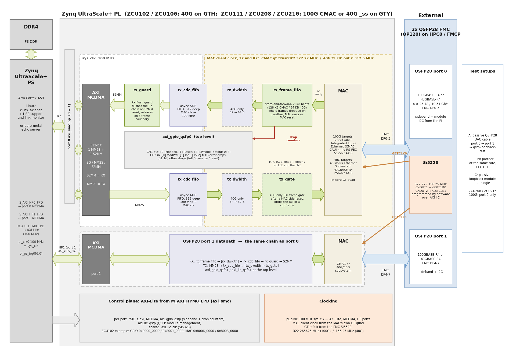
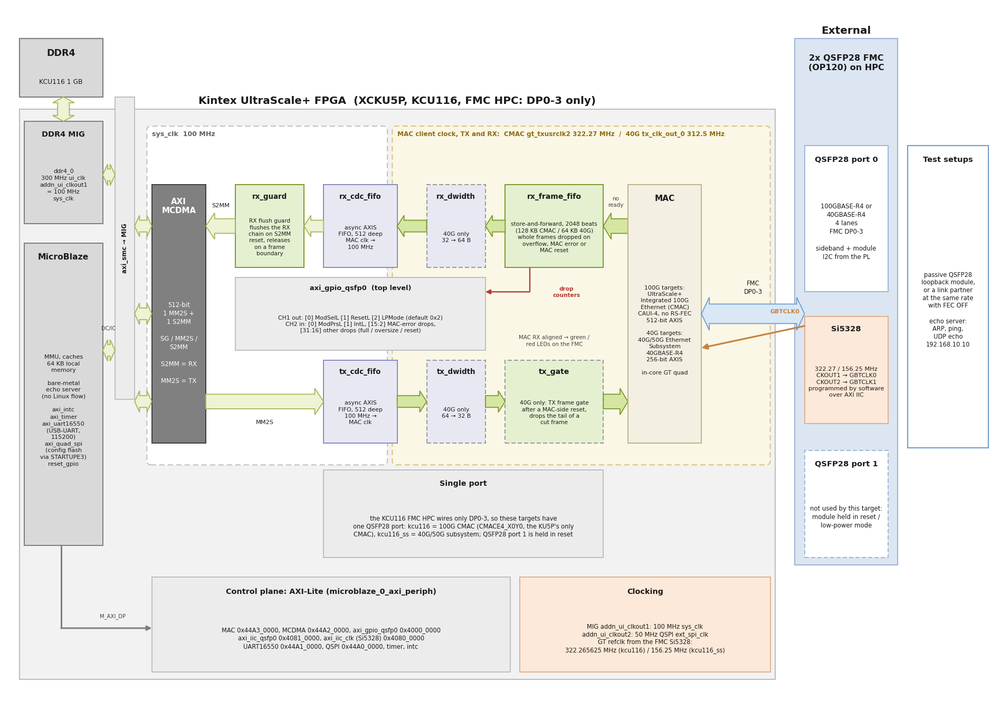

# Description

In this reference design, each QSFP28 port of the [2x QSFP28 FMC] (OP120) is driven as one
Ethernet channel over its four bonded transceiver lanes. The MAC that drives a port depends
on the target device family and on the speed of the carrier board's transceivers:

| Device family | Targets | MAC (one per QSFP28 port) | Line rate |
|---------------|---------|---------------------------|-----------|
| Versal | `vck190_fmcp1` | [Integrated 100G Multirate Ethernet MAC (MRMAC)], 1x100GE CAUI-4 | 100G |
| Zynq UltraScale+ RFSoC | `zcu111`, `zcu208`, `zcu216` | [UltraScale+ Integrated 100G Ethernet (CMAC)], CAUI-4 | 100G |
| Zynq UltraScale+ RFSoC | `zcu111_ss`, `zcu208_ss`, `zcu216_ss` | [40G/50G Ethernet Subsystem], 40GBASE-R4 | 40G |
| Zynq UltraScale+ MPSoC (GTH) | `zcu102_hpc0`, `zcu106_hpc0` | [40G/50G Ethernet Subsystem], 40GBASE-R4 | 40G |
| Kintex UltraScale+ (MicroBlaze) | `kcu116` | UltraScale+ Integrated 100G Ethernet (CMAC), CAUI-4 | 100G |
| Kintex UltraScale+ (MicroBlaze) | `kcu116_ss` | 40G/50G Ethernet Subsystem, 40GBASE-R4 | 40G |

In every design, packet data is moved to and from system memory (DDR) by one AXI MCDMA per
port, and the processor handles all packets: under Linux (PetaLinux or Yocto) the ports
are standard network interfaces driven by the AXI Ethernet (`xilinx_axienet`) driver, and
bare-metal they are driven by the included [echo server](echo_server). The KCU116 has no
processing system, so its targets use a MicroBlaze soft processor in front of the same
datapath and are supported with the standalone application only.

This contrasts with the Opsero [Quad SFP28 FMC] reference designs, which use one
independent 10G/25G channel per SFP28 port. Here each port bonds four lanes into one
100G or 40G MAC.

## Block diagrams

The architecture differs by device family, so there is one diagram per family. Each
diagram shows QSFP28 port 0 in detail; port 1 (where the target has one) is an identical
copy and is drawn compact. The Vivado block-design view of one port, cell by cell, is in
the [Vivado side](advanced.md#vivado-side) section of the advanced page.

### Versal (VCK190)

* **MRMAC (1x100GE CAUI-4).** The Versal integrated MRMAC is configured as a single 100GbE
  port with an independent 384-bit non-segmented client interface. The MRMACs of the two
  ports are placed at `MRMAC_X0Y0` and `MRMAC_X0Y2`, the sites next to their GT quads.
  RS-FEC is not used, so the link partner must have FEC turned off.
* **GT quad (GTY).** Each port uses one GTY quad: four lanes at 25.78125 Gb/s (80-bit raw
  datapath, LCPLL integer-N) from a 322.265625 MHz reference clock. Each lane's recovered
  RX clock drives that lane's MRMAC serdes clock through its own `BUFG_GT` pair, which
  CAUI-4 lane alignment requires.
* **MRMAC client adapters.** The MRMAC 100G client is not a standard AXI4-Stream bus: its
  384-bit data rides on six 64-bit lane ports. Two small RTL adapters
  (`mrmac_axis_adapter.v`) convert between the six lanes and one standard 384-bit stream.
  The RX adapter contains a store-and-forward **RX frame FIFO** (2048 × 48 bytes): the
  MRMAC cannot be stalled, so the FIFO absorbs bursts and downstream stalls, and when it
  overflows it drops whole frames (never a truncated or merged frame). Frames the MAC
  flags as errored are dropped too, and both kinds of drop are counted.
* **Datapath to DDR.** A width converter (384 ↔ 512 bit) and an asynchronous CDC FIFO bridge
  the 390.625 MHz MRMAC client clock to the 100 MHz system clock, where the AXI MCDMA
  moves packet data to and from DDR over three NoC ports (scatter-gather, MM2S, S2MM).
* **Control and sideband.** Per port, an AXI-Lite path reaches the MRMAC, the MCDMA and a
  GT-control AXI GPIO (GT resets, reset-done flags and the RX drop counters). An AXI IIC
  per port reaches the QSFP28 module management bus, a shared AXI IIC reaches the Si5328,
  and an AXI GPIO per port drives the module sideband signals (`ModSelL`, `ResetL`,
  `LPMode`, `ModPrsL`, `IntL`). The sideband GPIO powers up with `ResetL` released, so an
  inserted optical module or AOC is enabled as soon as the device is configured. Green and
  red LEDs on the FMC show each port's RX link status.
* **Clocking.** One Si5328 jitter-attenuating clock generator on the FMC sources both GT
  reference clocks (GBTCLK0 for port 0, GBTCLK1 for port 1). It is programmed by software
  (the Linux clock driver, or the echo server) at 322.265625 MHz.

### Zynq UltraScale+ (ZCU102, ZCU106, ZCU111, ZCU208, ZCU216)

ZynqMP devices have no MRMAC, so these targets use a different MAC while keeping the same
architecture (one MAC + AXI MCDMA per port, the CPU handles all packets):

* **RFSoC boards (ZCU111/ZCU208/ZCU216), 100G targets — CMAC.** Each active port is an
  UltraScale+ Integrated 100G Ethernet (CMAC) hard block in CAUI-4 mode (4 GTY lanes at
  25.78125 Gb/s, 322.265625 MHz reference clock) with its in-core GT quad and a standard
  512-bit AXI4-Stream client. RS-FEC is not included. On the ZCU111 both ports run 100G; on
  the ZCU208/ZCU216 only one of the two CMAC blocks can physically reach the FMC+ GT quads,
  so those targets implement a single 100G port (QSFP28 port 0) and hold the port 1 module
  in reset.
* **ZCU102/ZCU106, and the `_ss` targets of the RFSoC boards — 40G.** The GTH transceivers
  of the ZCU102/ZCU106 cannot run the 25.78125 Gb/s CAUI-4 lane rate, so each port is a
  40G/50G Ethernet Subsystem (soft MAC/PCS) in 40GBASE-R4 mode (4 lanes at 10.3125 Gb/s,
  156.25 MHz reference clock) with a 256-bit AXI4-Stream client. The `_ss` variants use
  the same core on the RFSoC GTY lanes; because the soft MAC has no placement restriction,
  they enable **both** QSFP28 ports on the ZCU208/ZCU216.
* **RX datapath.** The MAC's RX stream (which has no back-pressure) feeds a store-and-forward
  **RX frame FIFO** of 2048 beats (128 KB for the CMAC, 64 KB for the 40G subsystem) that
  drops whole frames on overflow, on a MAC-flagged error, or when a frame is cut by a MAC
  reset, and counts each kind of drop. On the 40G targets a width converter (256 → 512
  bit) follows. An asynchronous CDC FIFO crosses to the 100 MHz system clock and an
  **RX flush guard** sits in front of the MCDMA S2MM channel: the RX chain is flushed only
  when the DMA itself is reset, and traffic is released to the DMA on a frame boundary.
* **TX datapath.** The MCDMA MM2S stream crosses to the MAC clock through a CDC FIFO; on the
  40G targets a width converter (512 → 256 bit) and a **TX frame gate** follow. The gate
  discards the tail of a frame that was cut by a MAC-side reset, so that no fragment is
  ever transmitted as a frame of its own.
* **MAC clocking.** Both the TX and the RX client logic of a port run on the MAC's own
  transmit user clock: `gt_txusrclk2` (322.27 MHz) on the CMAC, `tx_clk_out_0` (312.5 MHz)
  on the 40G/50G Ethernet Subsystem, whose RX stream is launched by that clock.
* **Datapath to DDR.** Per port, the 512-bit AXI MCDMA reaches the PS DDR through its own
  `S_AXI_HPx_FPD` port (port 0 → HP0, port 1 → HP1). AXI-Lite control comes from
  `M_AXI_HPM0_LPD`, and the system clock is the PS `pl_clk0` (100 MHz).
* **Sideband and drop counters.** Each port's QSFP28 sideband AXI GPIO also carries the RX
  frame FIFO's drop counters on its second channel (see
  [RX drop counters](advanced.md#rx-drop-counters)).
* **Linux driver.** The ports are driven by the `xilinx_axienet` driver, to which the
  BSPs' kernel patches add CMAC / 40G-50G subsystem support, with a link monitor that
  brings the link up automatically once the Si5328 reference clock and a partner signal
  are present (see [Testing under Linux](linux_usage)).

### MicroBlaze (KCU116)

The Kintex UltraScale+ KCU116 has no processing system, so the `kcu116` (100G CMAC) and
`kcu116_ss` (40G subsystem) targets instantiate a MicroBlaze soft processor (MMU and caches)
running from the board's DDR4 (MIG), with the same per-port MAC, RX frame FIFO, flush guard,
TX gate and AXI MCDMA datapath as the Zynq UltraScale+ targets, plus an AXI UART16550
console, an AXI timer and interrupt controller, and an AXI Quad SPI reaching the board's
configuration flash through the STARTUPE3 primitive.

* The KCU116 FMC HPC connector wires only DP0-3 (one GTY quad, bank 227), so both KCU116
  targets are **single-port** (QSFP28 port 0); the port 1 module is held in reset.
* The KU5P device's single CMAC (`CMACE4_X0Y0`) reaches the FMC quad, giving a true 100G
  hard-MAC port on a device supported by the free Vivado Standard Edition.
* These targets are supported with the **standalone [echo server](echo_server) only**:
  the AMD EDF Yocto flow does not support Linux on MicroBlaze, and the PetaLinux flow is
  being retired for this repository. (An unsupported classic-MicroBlaze PetaLinux BSP
  remains in `PetaLinux/bsp/kcu116/` for reference.)
* The KCU116 microSD slot is connected to the board's system controller, not to the FPGA.
  Run the echo server over JTAG, or from the QSPI configuration flash.

## Supported Hardware Platforms

The hardware designs provided in this reference are based on Vivado and support the AMD
evaluation boards listed below. The repository contains all necessary scripts and code to
build the design for each supported platform:









### {{ group.name }} boards

| Carrier board    | Supported FMC connector(s) | Link speed(s) |
|------------------|----------------------------|---------------|
| [{{ name }}]({{ board.link }}) | {{ connector }}  | {{ board.speeds | join(", ") }} |




For two ports at 100G, the 2x QSFP28 FMC requires a carrier board whose FMC connector routes
eight gigabit transceivers (two QSFP28 ports × four lanes) capable of 25.78125 Gb/s, and an
AMD device with an integrated MRMAC or CMAC that can reach those transceivers. Boards that
route fewer lanes (KCU116: four) or slower transceivers (ZCU102/ZCU106: GTH) are supported
with fewer ports and/or the 40G subsystem MAC, as described above.

## Supported Software

These reference designs can be driven by a standalone (bare-metal) application or from
within an embedded Linux environment, built with either of two flows: PetaLinux, or
Yocto / EDF (AMD's Embedded Development Framework, the announced successor to
PetaLinux). The repository includes all necessary scripts and code to build each of
them. The table below outlines the corresponding applications available:

| Environment      | Available Applications  |
|------------------|-------------------------|
| Standalone       | Raw-Ethernet [echo server](echo_server) (ARP, ICMP ping, UDP echo on all QSFP28 ports) |
| PetaLinux / Yocto | Built-in Linux commands Additional tools: ethtool, iperf3, iproute2, nstat (Yocto), i2c-tools, phytool Bundled self-test: `qsfp-loopback-test` |

[2x QSFP28 FMC]: https://docs.opsero.com/op120/datasheet/overview/
[Quad SFP28 FMC]: https://docs.opsero.com/op081/datasheet/overview/
[Integrated 100G Multirate Ethernet MAC (MRMAC)]: https://www.amd.com/en/products/adaptive-socs-and-fpgas/intellectual-property/mrmac.html
[UltraScale+ Integrated 100G Ethernet (CMAC)]: https://www.amd.com/en/products/adaptive-socs-and-fpgas/intellectual-property/cmac_usplus.html
[40G/50G Ethernet Subsystem]: https://www.amd.com/en/products/adaptive-socs-and-fpgas/intellectual-property/ef-di-50gemac.html
